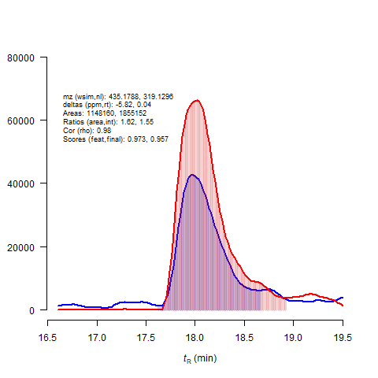

# wSIMCity:</br></br>Searching for DNA-adducts in DIA wide-SIM/MS<sup>2</sup> data

</br>

## Table of Contents  


[Background](#background)

[Overview of software](#overview)</br>

[Scoring](#scoring)

[Getting started](#getstart)

[Installation](#installation)</br>

[Dependencies](#dependencies)</br>

[Before you start](#beforestart)</br>

[Usage](#usage)</br>

</br></br>

## Background


Welcome to wSIMCity, a software for mining wide-selected ion monitoring/MS2 (Wide-SIM/MS<sup>2</sup>) mass spectrometry data. wSIMCity was developed by Scott Walmsley, PhD, of the Masonic Cancer Center and the Institute for Health Informatics at the University of Minnesota. Wide-SIM/MS<sup>2</sup> is a data-independent acquisition (DIA) strategy adopted from the SWATH methodology to monitor the neutral loss of 2′-deoxyribose (dR) from modified 2′-deoxyribonucleosides for DNA adductomic analysis (reference). wSIMCity was developed to overcome data structure issues in Wide-SIM/MS2 data which limited the usefulness of existing software solutions and provides for the automated detection of DNA adducts. The workflow uses R-packages to process Wide-SIM/MS<sup>2</sup> raw data and to mine potential DNA adducts retrospectively. This algorithm can also be applied to detect classes of compounds that share common neutral losses under CID fragmentation. 
</br></br>
The Wide-SIM/MS<sup>2</sup> as a data independent acquisition (DIA) methodology was developed for sensitive and comprehensive detection of trace level covalent modifications of DNA, known as DNA adducts. These adducts form upon exposure of DNA to environmental genotoxicants and endogenously produced electrophiles. DNA adducts at critical sites in tumor-related genes are believed to be the first step in chemical carcinogenesis. They can serve as biomarkers of exposure and interspecies extrapolation of toxicity data. 
</br>
DNA adducts were usually detected as nucleosides in samples where the DNA has been hydrolysed by a cocktail of enzymes. The figure below shows the structure of a representative DNA adduct:</br>


<p align="center">

</p>

The blue portion of the DNA adduct is the mutagen or carcinogen, which in this case is covalently bound to the C8 position of a 2′-deoxyguoanosine (guanine in black and dR in red). The facile glycosidic bond between nucleobase and dR is prone to dissociate when subjected to CID fragmentation, generating the adducted nucleobase ion and dR as neutral fragment. Generally speaking, this mechanism is universal for DNA adducts. The ions at the MS1 level are known as precursor ions (denoted: [M+H]<sup>+</sup>), and the resulting ion after the neutral loss is called the 'aglycone' (denoted as [M+H-116.0473]<sup>+</sup> or [B+H<sub>2</sub>]<sup>+</sup>). Note the gain of a mobile proton on the aglycone molecule, hence the '+H' notation.

</br>

Targeted detection of DNA adducts is fairly straightforward. However, capturing the global picture of adduct formation in the human genome requires more comprehensive screening strategies. Below is a figure comparing the data dependent acquisition (DDA) and DIA scanning methods commonly utilized in proteomics and metabolomics (A), and recently developed methods for DNA adductomics, including the DNA adductomic DDA constant neutral loss MS3 (CNL-MS3) method (panel B) and the DIA Wide-SIM/MS<sup>2</sup> method (panel C), the later for which this software package was written. In order to improve the sensitivity of detection, the m/z range of potential DNA adducts, 330–630, was equally split into 10 sections. Each section consists of a Wide-SIM detection of a 30 m/z mass range followed by CID-MS<sup>2</sup> detection (m/z 100 – 650), with isolation of the same mass range as the corresponding SIM event. Both the Wide-SIM precursor ions and MS2 product ions were detected with the high-resolution Orbitrap MS detector to achieve accurate formula assignment. Potential DNA adducts were characterized by co-elution of the extracted precursor ions ([M+H]<sup>+</sup>) in the Wide-SIM scan and the aglycones ([BH<sub>2</sub>]<sup>+</sup>) in the succeeding MS<sup>2</sup> scan at a mass tolerance of 5 ppm. This data acquisition format (panel C) leads to incompatibilities with current DDA/DIA software developed for proteomics and metabolomics.

</br></br>

<p align="center">

</p>

</br></br></br>

<a name="overview"/>

## Overview of wSIMCity

wSIMCity seeks to discover the 'landscape' or map of DNA-adducts in a DNA sample prepared for and analyzed using wide-SIM/MS<sup>2</sup> data acquisition. The overall workflow is shown in the next figure:

</br></br>

<p align="center">

</p>


</br></br></br>


Software developed for the DIA methods (and previous DDA methodologies) have worked well, but are incompatible with our current wide-SIM/MS<sup>2</sup> scanning technique. Therefore we have implemented a simple workaround using the R package ```mzR```, incorporating the MSDIAL feature finding algorithm, and devising a custom global statistical model and search strategy to detect the adducts. Extracted ion chromatograms (EIC) for candidate molecules are produced. Further we devised a scheme to best leverage a global sample-wise scoring method together with an individual scoring metric to help the researcher identify and pursue candidate DNA adduct molecules for identification. The output of wSIMCity is list of masses and retention times to be used for targeted identification using CID MS.</br>
## Scoring<a name="scoring"/>

An important aspect of wSIMCity is that it scores the identification of putative DNA adducts to prioritize  candidate DNA adducts for further analysis.  

The scoring is broken down into a few components. The first component is borrowed from MSDIAL for matching detected compounds with those listed in a mass and retention database. We modify the MSDIAL approach to match precursor - aglycone molecules found in DNA adductomics data. 

A major difference between our scoring method and that of MSDIAL is the underlying assumptions about the distributive properties of the measured values of the two data types: we use ppm mass errors to differentiate between real [M+H]+ and [B+H<sub>2</sub>]<sup>2</sup> pairs of features and false hits. Specifically, for every [M+H]<sup>+</sup> ion, we compute a theoretical [M+H-116.0473]<sup>+</sup> *m/z*, and then look for [B+H<sub>2</sub>]<sup>+</sup> ions with that mass and retention time. We look for every ion with that *m/z* value and determine the mass deviation in ppm. This measurement is called 'Mass err (ppm)' in the plot above. These measured data points follow a Gaussian distribution. 

</br></br></br>

<a name="getstart"/>


From these results, a list of candidate ions are produced and then re-extracted from the data.  Since the input into the algorithm uses feature finding software that can produce a lot of false positives when trying to detect ions of low abundance, the precursor - aglycone ions are re-extracted using the raw MS data files. New scores are computed, and peak shape correlations are computed and used as a final metric.  The result is a plot for each putative DNA-adduct passing a minimum criterion (peak shape correlation, score, ratio) that the researcher can use to determine if the ion is worth identifying:

</br></br>

<p align="center">

</p>

</br></br></br>


</br>


## Getting started

<a name="installation"/>

## 1. Installation
Start by downloading and installing the source R package. Don't forget to set your .libPaths() environment if needed:
```{r}

.libPaths("path to R library folder")

```
To finish installation, we strongly suggest downloading the repository as a zip package.   Then open the R package using R-studio.   Then use the install button in RStudio to complete the installation into your R library.


## 2. Dependencies

#### Operating system:

Please note that due to the fact that software for acquiring and processing the mass spectrometry data used in this workflow was developed for Windows operating systems.   While some functions can be adapted to run on other operating systems, the very fact that Windows is used to run the mass spectrometers, to convert raw data to mzML,  and to process data into feature lists means you will likely need to run this workflow using a Windows computer.</br>

The R dependencies are:

#### R packages:

1. mzR : for reading mzML raw data
2. Rcpp : for mzR
</br></br>

#### Windows compatible software:

1. The proteowizard msconvert software: for converting Thermo .Raw files (or any other supported vendor) to mzML format.

### 3. Before you start<a name="beforestart"/>:

#### These include:
The software will produce a scan definition file automatically by reading the mass ranges from the filter list in the mzML file.
#### 1. A scan definition file.  

This file describes one duty cycle on the instrument in DIA SIM mode and defines what the *m/z* ranges for the wide SIM-MS<sup>2</sup> are.  It is tab delimited and is in the form:

|ScanType|WindowStart|WindowEnd|AquisitionStart|AcquisitionEnd|
|:---:|:---:|:---:|:---:|:---:|
|WSIM|197|364|330|364|
|NL|100|550|330|364|
|WSIM|197|394|360|394|
|NL|100|550|360|394|
|WSIM|197|424|390|424|
|NL|100|550|390|424|
|WSIM|197|454|420|454|
|NL|100|550|420|454|
|WSIM|197|484|450|484|
|NL|100|550|450|484|
|WSIM|197|514|480|514|
|NL|100|550|480|514|
|WSIM|197|544|510|544|
|NL|100|550|510|544|
|WSIM|197|574|540|574|
|NL|100|550|540|574|
|WSIM|197|604|570|604|
|NL|100|550|570|604|
|WSIM|197|634|600|634|
|NL|100|550|600|634|

##### Notes:

```ScanType``` is one of either 'WSIM' or 'NL' used to denote the scan level (MS<sup>1</sup> or MS<sup>2</sup>).</br>
```WindowStart``` and ```WindowEnd``` indicate the start and end *m/z* values for the data collection *m/z* range as set at the instrument.</br>
```AquisitionStart``` and ```AqcuisitionEnd``` denote the start and end *m/z* values for the mass range you filtered your data on during the run.


### Processing workflow:


