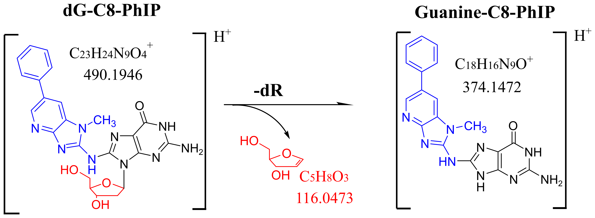

# wSIMCity: mining for DNA-adducts using wide - SIM mass spectrometry


## Background

Welcome to wSIMCity, software for mining Wide Sim mass spectrometry data.  wSIMCity was developed by Scott Walmsley, PhD, of the Masonic Cancer Center at the Univerity of Minnesota - Twin Cities in the laboratory of Prof. Rob Turesky, PhD.  Development of wSIMCity was brought about by necessity to overcome data structure issues in wide-SIM data independent acquisition (DIA) data produced in DNA-adduct mass spectrometry (MS) experiments.  As such we developed an R-package to process raw w-SIM DIA data and to mine for DNA-adducts in that data.  

wSIM-DIA methods were developed to increase sensitivity for DNA-adducts detected in digests of DNA and using mass spectrometry. More specfically, the automatic gain control (AGC) of orbitrap MS is used together with wide selected ion monitoring (wide-SIM) m/z ranges to boost sensitivity for the ions of interest. The wide-SIM MS^1 data is collected and then then subsequent scan undergoes a low energy collision induced dissociation (CID) of ~20meV.  This MS2 scan leverages the known neutral loss at low energy CID of a dexoyribose and serves as the tell tale sign of the presence of a DNA-adduct.   Turesky and group pioneered this altered DIA methodology and it likely will serve as a strategy for untargeted disvoery of novel DNA-adducts. The general mechanism is show below using the molecule dG-C8-PhIP, an important carcinogen of prostate caused by overcooked meats:</br>


<p align="center">

</p>

The blue portion of the molecule is the mutagen or carcinogen, shown bound to the nucleoside (black and red).   MS2 CID (25meV) causes the neutral loss of a deoxyribose (dR, red) leading to the formation of Guanine-C8-PhIP.  Generally speaking, it has been shown that this mechanism is universal across as wide spectrum of mutated DNA adduct pairs.   The ions at the MS1 level are described in generally as presursor ions (denoted: [M+H]+), and the resulting ion after the neutral loss is called the 'aglycone' (denoted as: [B+H2]+).  Note the gain of a mobile proton, hence the '+H2'.

Targeted extraction of molecules such as dG-C8-PhIP from this type of data is fairly straightforward.   However, a major goal is to facilitate untargeted detection of DNA-adducts using this adaption to proteomics' / metabolomics' data independent acquisition (DIA) methodologies. Below is a figure showing the slight differences between proteomics/ metabolommics (A) for DIA and DDA methods, and methods developed for DNA adductomics (B and C). Included in panel B is DDA method for DNA work called constant neutral loss screening.  Panel C is the method for which this software was originally written:

</br></br>

<p align="center">

</p>

</br></br></br>


## Overview of wSIMCity

wSIMCity seeks to discover the 'landscape' or map of DNA-adducts in a DNA sample prepared for and analyzed using wide-SIM-MS.  The overall workflow is shown in the next figure:

</br></br>

<p align="center">

</p>


</br></br></br>


Software developed for the DIA methods (and previously data dynamic acquisition (DDA) methodologies) have worked well, but are incompatible with our current wide-SIM scanning technique.   Therefor we have implemented a simple workaround using the R package ```mzR```, incorporated the MSDIAL feature finding algortihm, and devised a custom global modelling and search strategy to detect the adducts.   Extracted ion chromatograms (EIC) for candidate molecules are produced.  Further we devised a scheme to best levereage a global scoring method together with an individual scoring metric to help the researcher identify and pursue DNA-adduct identification.   The end result of wSIMCity is a targeted list masses and retention times for high energy dissociation MS and structural determination of the candidate molecules. 

## Scoring

The best component of wSIMCIty is it produces a series of scores to help the researcher rummage through the list of candidate DNA-adducts.  

The score is broken down into several components. The first components are borrowed from MSDIAL's scoring method for detecting similar features and for detecting molecules listed in a mass and retention database.  The key difference between our method and MSDIAL's is that the underlying assumptions about the distributive properties of the measured values in our data are a little differnt:  we use ppm mass errors to differentiate between real [M+H]+ and [B+H2]+ pairs of features and false hits.  These measured data points follow a Laplace distribution. We also, like MSDIAL, incorporate retention time as a metric.  Like MSDIAL, our assumption here follows a guassian distribition. [B+H2]+ ions ALWAYS follow their [M+H]+ ions by a single MS scan, so a strong emphasis is placed on the RT scoring.   

The second component to our scoring system uses global modeling.  Global modeling serves as a method to ensure the key assumtions in the 1st component scoring methods are correct, but also lets the researcher know about the overall quality of the group of scores produced for the putative DNA-adducts. The global model looks like this: 

<p align="center">

</p>


## 1. Installation
Start by downloading and installing the source R package. Don't forget to set your .libPaths() environment if needed.
```{r}

.libPaths("path to R library folder")

devtools::install_github("scottwalmsley/wSIMCity")


```

## 2. Dependencies
#### Operating system:

Please note that due to the fact that software for acquiring and processing the mass spectrometry data used in this workflow was developed for Windows operating systems.   While some functions can be adapted to run on other operating systems, the very fact that Windows is used to run the mass spectrometers, to convert raw data to mzML,  and to process data into feature lists means you will likely need to run this workflow using a Windows computer.</br>

You can run a function that is provided in wSIMCity that will check for installed dependencies. These include:


#### R packages:

1. mzR : for reading mzML raw data
2. Rcpp : for mzR
3. doParallel : for multi threading
</br></br>


```{r}

wSIMCity::chckDependencies()

```
#### Windows compatible software:

1. The proteowizard msconvert software: for converting Thermo .Raw files (or any other supported vendor)
2. MSDIal : for feature finding.


## 3. Before you start:

wSIMCity needs to have multiple items specified for it to work correctly.   

#### These include:
#####1. A scan definition file.  
This file describes one duty cycle on the instrument in DIA SIM mode and defines what the m/z ranges for the wide SIM-MS^2 are.  it is tab delimited and is in the form:

|ScanType|WindowStart|WindowEnd|AquisitionStart|AcquisitionEnd|
|:------:|:---------:|:-------:|:-------------:|:-------------:|
|WSIM|197|364|330|364|
|NL|100|550|330|364|
|WSIM|197|394|360|394|
|NL|100|550|360|394|
|WSIM|197|424|390|424|
|NL|100|550|390|424|
|WSIM|197|454|420|454|
|NL|100|550|420|454|
|WSIM|197|484|450|484|
|NL|100|550|450|484|
|WSIM|197|514|480|514|
|NL|100|550|480|514|
|WSIM|197|544|510|544|
|NL|100|550|510|544|
|WSIM|197|574|540|574|
|NL|100|550|540|574|
|WSIM|197|604|570|604|
|NL|100|550|570|604|
|WSIM|197|634|600|634|
|NL|100|550|600|634|

##### Notes:
```ScanType``` is one of either 'WSIM' or 'NL' used to denote the scan level (MS1 or MS2).
```WindowStart``` and ```WindowEnd``` indicate the start and end m/z values for the data collection m/z range as set at the instrument.
```AquisitionStart``` and ```AqcuisitionEnd``` denote the start and end m/z values for the mass range you filtered your data on during the run.

#####2. A MSDIAL parameters file.
This file is the MSDIAL parameters file used with running the MSDIAL command line program.  wSIMCity will convert your raw data and then run MSDIAL to find features in your data.

#####3. A file of adducts to search between MS scan levels.
This is the tab delimited text file containing the list of adducts masses you wish to search.


### Set your paths and environment variables.

```{r}


```

  


